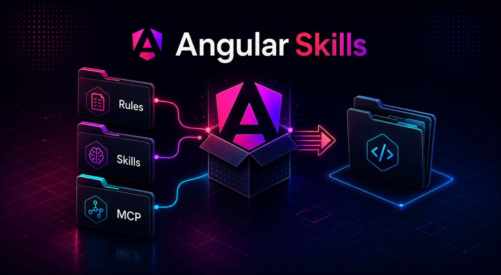

# Angular Skills



Reusable Angular coding rules and skills for Angular projects.

This repository provides a CLI that copies a ready-to-use `.angular-skills` directory into any project. It can also configure the official Angular CLI MCP server for your editor.

## Install In Another Project

Run this command from the root of the project where you want to add Angular Skills:

```bash
npx github:vadost/angular-skills
```

After running it, the target project will contain:

```text
.angular-skills/
  rules/
  skills/
```

The command copies the files from this repository into the current working directory.

## Angular CLI MCP Setup

After creating `.angular-skills`, the CLI asks whether to connect the official Angular CLI MCP server. The default answer is `No`, so pressing Enter skips MCP setup.

If you choose `Yes`, select one of the editor options from the official Angular MCP instructions:

```text
1. Cursor
2. Firebase Studio
3. Gemini CLI
4. JetBrains IDEs
5. VS Code
6. Other IDEs
7. Skip MCP setup
```

The CLI writes the official Angular MCP server configuration where the official instructions define a project config file:

```json
{
  "mcpServers": {
    "angular-cli": {
      "command": "npx",
      "args": ["-y", "@angular/cli", "mcp"]
    }
  }
}
```

For VS Code, the official format uses `servers` instead of `mcpServers`:

```json
{
  "servers": {
    "angular-cli": {
      "command": "npx",
      "args": ["-y", "@angular/cli", "mcp"]
    }
  }
}
```

Generated config locations:

| Editor | Config path | JSON key |
| --- | --- | --- |
| Cursor | `.cursor/mcp.json` | `mcpServers` |
| Firebase Studio | `.idx/mcp.json` | `mcpServers` |
| Gemini CLI | `.gemini/settings.json` | `mcpServers` |
| VS Code | `.vscode/mcp.json` | `servers` |
| Other IDEs | Prompted path, default `mcp.json`, or `mcp/angular-cli-mcp.json` snippet | `mcpServers` |

JetBrains IDEs use a manual UI flow in the official instructions. For JetBrains, the CLI creates a temporary copy-paste snippet:

```text
mcp/angular-cli-mcp.json
```

Paste this file's contents into `Settings | Tools | AI Assistant | Model Context Protocol (MCP)`, then add a new server and select `As JSON`.

You can delete the `mcp/` folder after setup. This folder is only a convenience snippet, not a required Angular Skills runtime file.

For Other IDEs, you can either enter the real MCP config file path or create the same `mcp/angular-cli-mcp.json` snippet for manual copy-paste.

To skip the MCP question entirely, run:

```bash
npx github:vadost/angular-skills --skip-mcp
```

Official Angular MCP documentation: <https://angular.dev/ai/mcp>

## Existing `.angular-skills` Directory

By default, the command does not overwrite an existing `.angular-skills` directory:

```bash
npx github:vadost/angular-skills
```

To replace an existing copy, run:

```bash
npx github:vadost/angular-skills --force
```

## Output Structure

After installation, the target project will receive this structure:

```text
.angular-skills/
  rules/
    guidelines.md
  skills/
    angular-developer/
      SKILL.md
      references/
    angular-new-app/
      SKILL.md
    best-practices.md
```
